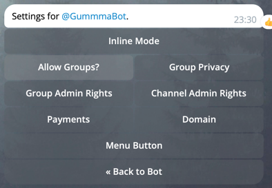
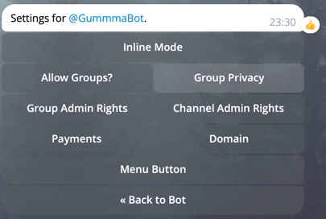

# kibernikto

Kibernikto is the app to easily run telegram bots connected to AI models.

One Kibernikto instance can be connected to one Telegram bot and work with one group chat. Privately it talks to master
only and denies other users.

Kibernikto can be added to any group chat (`TG_FRIEND_GROUP_ID`). The bot will need chat messages access set in group to
operate.
Private chat is only available for one master user (`TG_MASTER_ID`).

# environment:

- Default [OpenAI](https://openai.com)

```
OPENAI_API_BASE=https://api.openai.com/v1
OPENAI_API_MODEL=gpt-4
OPENAI_API_KEY=yr-key  
```

- Multimodel [vsegpt.ru](https://vsegpt.ru/)

```
OPENAI_API_BASE=https://api.vsegpt.ru:6070/v1  
OPENAI_API_KEY=sk-yr-key  
OPENAI_API_MODEL=openai/gpt-4  
```

```
OPENAI_MAX_TOKENS=800  
OPENAI_WHO_AM_I=Answer all questions as {0} named Киберникто, the majestic lord of the universes with all the knowledge of our small planet.  

# Youtube video summaries
# If no key is provided, youtube videos will be ignored.
SUMMARIZATION_KEY=sk-yr-key
SUMMARIZATION_API_BASE=https://api.vsegpt.ru:6070/v1  
SUMMARIZATION_MODEL=anthropic/claude-instant-v1

# Telegram configuration
TG_BOT_KEY=XXXXXXXXXX:XXXxxxXXXxxxxXXXxxx  
TG_BOT_MAX_HISTORY=8  
TG_FRIEND_GROUP_ID=-XXXXXXXXXX  
TG_MASTER_ID=XXXXXXXXX
# Cybernoone reacts to direct replies or when sees the following words  
TG_REACTION_CALLS=киберникто,государь  
# sometimes Cybernoone sends stickers for fun together with his answers  
TG_STICKER_LIST=CAACAgIAAxkBAAEKqsplQ8BRyPbGj_B_K4ujCLsDAe-l7wAC8AIAAs-71A7mCrGe-zzi0DME,CAACAgIAAxkBAAEIgoxkMaHv1maOeEne8CYAAY5s4kJ1e4wAAo4JAAIItxkCXSMuZ6bo59gvBA
```

For the full list of variables, see `constants.py` file.

# useful links

To create and operate your bot: https://t.me/BotFather  
To obtain group/user ids etc: https://t.me/getidsbot  
To obtain sticker ids: https://t.me/idstickerbot  
To get familiar with basic OpenAI principles: https://openai.com  
To find out more on models and multi-model api details: https://vsegpt.ru/Docs/Models.

# how to run

- Create your bot using BotFather and obtain it's key. You can also change the picture and other details there. Set
  env `TG_BOT_KEY`
- Add your bot to the group you want. Set env `TG_FRIEND_GROUP_ID`. You can get the group ID using getidsbot.
- Add proper permissions to your bot in the group.
- Configure other env variables.
- Install the requirements `pip install -r requirements.txt`
- Run `main.py` file using the environment provided.
- Enjoy!

# QA
Q: What if I can not add my bot to the group?  
A: Check if groups are allowed for yr bot in @BotFather.
  


Q: My bot can not see the messages in group. What's wrong?   
A: Turn off the group privacy for your bot.

